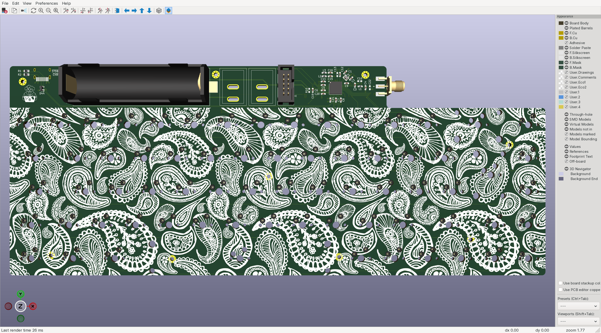
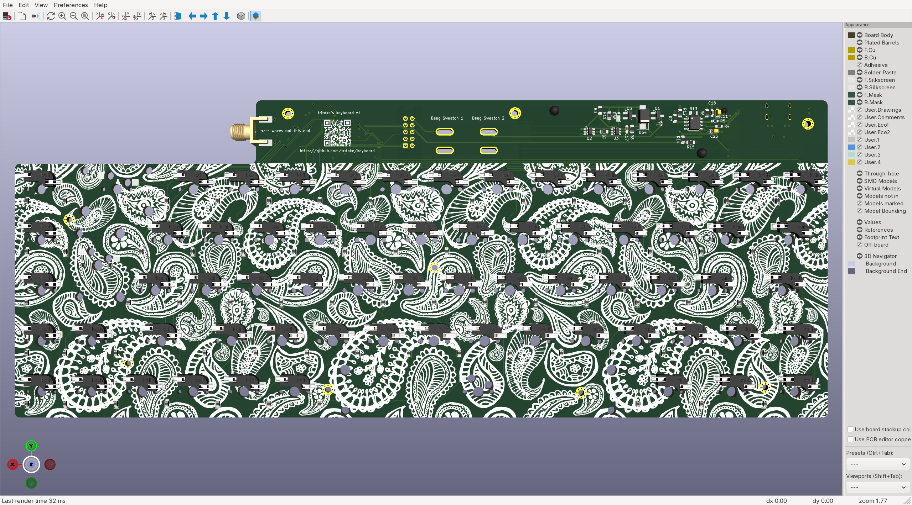

# keyboard

This is my efforts towards making the exact keyboard entirely for fun.

Wants:
- Usable over USB or Bluetooth
- 65% with arrow keys, ISO enter and the four keys on the right

Progress:
- PCB (rev1 done)
- Case (freeCAD is kicking my ass)
- Firmware (I have some thoughts and that is all)

## PCB

Revision 1 of the PCB is now complete:

